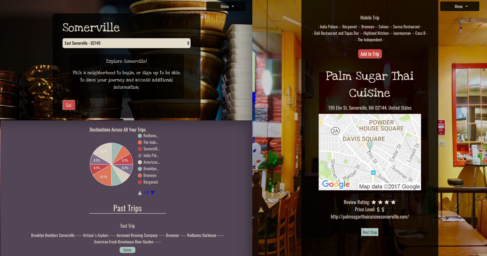

# Somerville

Heroku Link: http://somerville.herokuapp.com/

A personalized tourism site for the city of Somerville where users can explore and plan activities based on neighborhood. If signed in, a user has access to a trip dashboard. Users can select a neighborhood and are randomly given activities which they can choose to add to a trip. Users can also create and save notes to activities.

I utilized React to give users a smooth and seamless experience when creating trips, adding activities to trips, and selecting former trips to continue working on. In addition, I used Google Places API, Google Maps API, and Google Charts for information and data visualization that shows the usage percentage of a specific activity added across a user's trips. An Alexa skill has also been integrated.

## Features

* Creating an account
* Exploring local activities
* Creating, updating, and selecting trips
* Adding or deleting activities from trips
* Maps that show the location of the activity
* Rating and price levels for the activities
* Graphs showing the frequency an activity is added across a user's trips
* Integrated Alexa skill: "Somerville Guide"

## Technologies

* Ruby on Rails
* React.js
* PostgreSQL
* Alexa
* Google Places API
* Google Maps API
* Google Charts
* Devise
* Foundation
* RSpec
* Capybara
* VCR

## To-Do List

* Make the front end entirely in React.js utilizing React Router
* Write React tests
